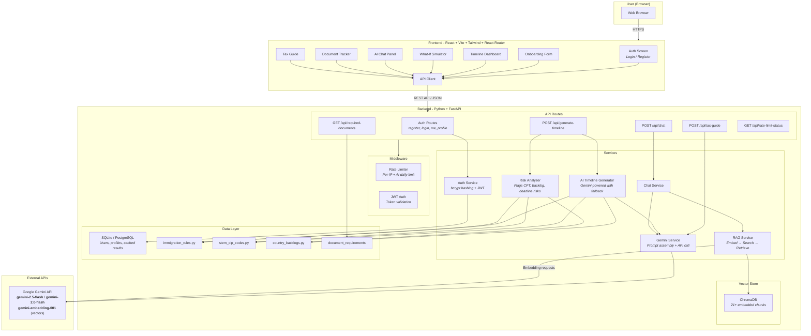
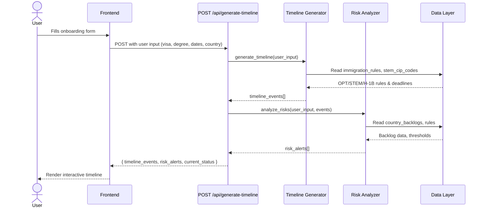
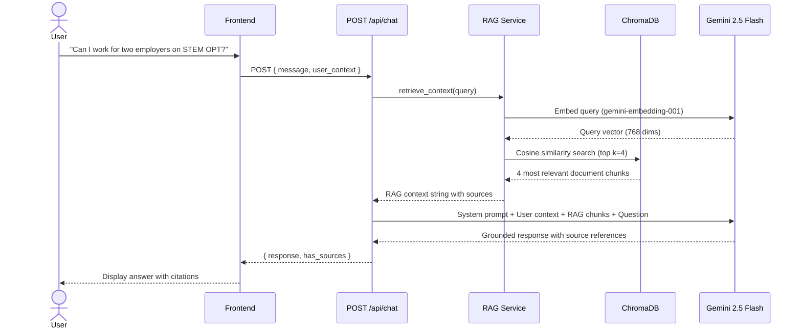
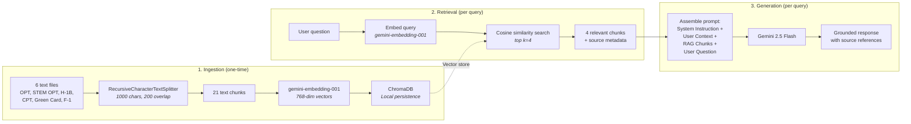

# VisaPath - AI Immigration Timeline Planner

> **DevDash 2026 Hackathon Submission**
> An AI-powered web application that helps international students in the US navigate their immigration journey with personalized timelines, risk alerts, and AI-powered Q&A.

---

## Table of Contents

- [Problem](#problem)
- [Solution](#solution)
- [Architecture Overview](#architecture-overview)
- [System Architecture Diagram](#system-architecture-diagram)
- [Tech Stack](#tech-stack)
- [Backend Architecture](#backend-architecture)
  - [API Endpoints](#api-endpoints)
  - [Timeline Generation Engine](#timeline-generation-engine)
  - [Risk Analysis Engine](#risk-analysis-engine)
  - [RAG Pipeline (Retrieval-Augmented Generation)](#rag-pipeline-retrieval-augmented-generation)
  - [AI Chat Service](#ai-chat-service)
- [Data Layer](#data-layer)
- [Project Structure](#project-structure)
- [Setup & Installation](#setup--installation)
- [Deployment](#deployment)
- [Build Log](#build-log)

---

## Problem

Over 1 million international students in the US navigate a confusing maze of visa deadlines, employment authorization windows, and immigration milestones. Information is scattered across USCIS pages, Reddit threads, university DSO offices, and expensive lawyers. **A single missed deadline can end your legal status in the US.** There is no single tool that gives students a clear, personalized view of their immigration journey.

## Solution

VisaPath generates a **personalized, interactive immigration roadmap** based on each student's specific situation. Students input their visa type, program details, and career goals, and receive:

- An AI-generated interactive timeline with every critical deadline
- Color-coded risk alerts for potential issues
- Actionable to-do checklists with deadlines
- Document preparation trackers
- AI-powered Q&A grounded in official USCIS documentation (RAG)
- Personalized tax filing guide for international students
- What-If Simulator to explore alternative immigration scenarios
- Full authentication with profile persistence across sessions

---

## Architecture Overview

VisaPath follows a **client-server architecture** with a React frontend (React Router for navigation), Python FastAPI backend with JWT auth, a SQLite/PostgreSQL database for user persistence, and a RAG-augmented AI system for chat, timeline generation, and tax guidance.



---

## System Architecture Diagram

### Request Flow: Timeline Generation



### Request Flow: AI Chat (RAG Pipeline)



---

## Tech Stack

| Layer | Technology | Purpose |
|-------|-----------|---------|
| **Frontend** | React 18 + TypeScript | UI components and state management |
| **Routing** | React Router v6 | URL-based navigation with route guards |
| **Build Tool** | Vite | Fast dev server and production builds |
| **Styling** | Tailwind CSS | Utility-first CSS framework |
| **Backend** | Python 3.13 + FastAPI | REST API server |
| **Auth** | JWT + bcrypt | Stateless authentication with hashed passwords |
| **Database** | SQLite (dev) / PostgreSQL (prod) | User accounts, profiles, cached AI results |
| **AI Model** | Google Gemini 2.5 Flash / 2.0 Flash | Timeline generation, tax guide, contextual Q&A |
| **Embeddings** | gemini-embedding-001 | Vector embeddings for RAG |
| **Vector DB** | ChromaDB | Local vector storage and similarity search |
| **RAG Framework** | LangChain | Document processing, text splitting, embedding orchestration |
| **Frontend Hosting** | Azure Static Web Apps | Free tier |
| **Backend Hosting** | Azure App Service | Free tier (Azure for Students) |

---

## Backend Architecture

### API Endpoints

#### `POST /api/generate-timeline`

Generates a personalized immigration timeline based on user input.

**Request Body:**
```json
{
  "visa_type": "F-1",
  "degree_level": "Master's",
  "is_stem": true,
  "program_start": "2024-08-20",
  "expected_graduation": "2026-05-15",
  "cpt_months_used": 6,
  "currently_employed": true,
  "career_goal": "stay_us_longterm",
  "country": "India"
}
```

**Response:**
```json
{
  "timeline_events": [
    {
      "id": "opt_apply_window_open",
      "title": "OPT Application Window Opens",
      "date": "2026-02-14",
      "type": "deadline",
      "urgency": "critical",
      "description": "You can start applying for post-completion OPT...",
      "action_items": ["Request OPT recommendation from DSO", "..."],
      "is_past": false
    }
  ],
  "risk_alerts": [
    {
      "type": "country_backlog",
      "severity": "warning",
      "message": "As a national of India, EB-2/EB-3 green card wait times...",
      "recommendation": "Consider EB-1 eligibility..."
    }
  ],
  "current_status": {
    "visa": "F-1",
    "work_auth": "Student (CPT/On-Campus)",
    "days_until_next_deadline": 1,
    "next_deadline": "OPT Application Window Opens"
  }
}
```

#### `POST /api/chat`

AI-powered Q&A with RAG context retrieval.

**Request Body:**
```json
{
  "message": "Can I work for two employers on STEM OPT?",
  "user_context": {
    "visa_type": "F-1",
    "degree_level": "Master's",
    "is_stem": true,
    "country": "India"
  }
}
```

**Response:**
```json
{
  "response": "Yes, you can work for multiple employers on STEM OPT, but each employer must be enrolled in E-Verify...",
  "has_sources": true
}
```

#### `POST /api/tax-guide`

Generates a personalized tax filing guide for international students using AI + RAG.

**Request Body:**
```json
{
  "visa_type": "F-1",
  "country": "India",
  "has_income": true,
  "income_types": ["wages"],
  "years_in_us": 2
}
```

**Response:**
```json
{
  "filing_deadline": "April 15, 2026",
  "residency_status": "Nonresident Alien",
  "required_forms": ["Form 8843", "Form 1040-NR"],
  "treaty_benefits": { "country": "India", "benefit": "...", "form": "Form 8233" },
  "fica_exempt": true,
  "guidance": "### Filing Requirements\n...",
  "disclaimer": "This is general guidance, not legal or tax advice."
}
```

#### `GET /api/rate-limit-status`

Returns current AI usage so the frontend can pre-check before triggering expensive AI calls.

**Response:**
```json
{
  "used": 5,
  "limit": 1500,
  "remaining": 1495,
  "allowed": true,
  "retry_after": 0
}
```

#### Auth Endpoints

| Endpoint | Method | Description |
|----------|--------|-------------|
| `/api/auth/register` | POST | Create account (email + password) |
| `/api/auth/login` | POST | Login, returns JWT token |
| `/api/auth/me` | GET | Get current user profile + cached data |
| `/api/auth/profile` | PUT | Save/update user profile |
| `/api/auth/cached-timeline` | PUT | Cache AI-generated timeline |
| `/api/auth/cached-tax-guide` | PUT | Cache AI-generated tax guide |
| `/api/auth/save-timeline` | POST | Save timeline to history |
| `/api/auth/my-timelines` | GET | Get saved timeline history |

#### `GET /api/required-documents?step=opt_application`

Returns document checklists for immigration steps.

**Available steps:** `opt_application`, `stem_opt_extension`, `h1b_petition`, `green_card_perm`

### Timeline Generation Engine

**File:** `backend/app/services/timeline_generator.py`

The timeline generator is a **rule-based calculation engine** that takes user input and computes all relevant immigration dates using hardcoded USCIS rules.

**How it works:**

1. **Parse user input** including visa type, graduation date, STEM status, country, career goal
2. **Branch by visa type** with different logic for F-1, OPT, H-1B
3. **Calculate dates using USCIS rules:**
   - OPT window: `graduation - 90 days` to `graduation + 60 days`
   - OPT duration: 12 months from graduation
   - STEM OPT extension: additional 24 months (if STEM)
   - H-1B registration: March of each year
   - Cap-gap: April 1 to October 1
   - Unemployment limits: 90 days (OPT) / 150 days (STEM OPT)
4. **Assign urgency levels** based on proximity to today:
   - `critical`: ≤ 7 days away
   - `high`: ≤ 30 days away
   - `medium`: ≤ 90 days away
   - `low`: > 90 days away
5. **Attach action items** with specific to-dos for each deadline
6. **Sort chronologically** and mark past events

**Supported visa pathways:**
- F-1 → OPT → STEM OPT → H-1B → Green Card
- F-1 → H-1B (direct, if CPT maxed out)
- OPT → STEM OPT → H-1B
- H-1B → Green Card

### Risk Analysis Engine

**File:** `backend/app/services/risk_analyzer.py`

The risk analyzer evaluates user input and flags potential immigration issues.

**Risk categories detected:**

| Risk | Severity | Trigger |
|------|----------|---------|
| CPT overuse (12+ months) | Critical | Kills OPT eligibility |
| CPT approaching limit (9+ months) | Warning | Close to losing OPT |
| Country backlog (India/China) | Warning | 10-30+ year green card waits |
| OPT deadline approaching (<30 days) | Critical | Risk of missing OPT window |
| Graduation approaching (<30 days) | High | Ensure OPT is filed |
| Non-STEM limited OPT | Info | Only 12 months, no extension |
| Unemployment on OPT | High | 90/150 day limits |
| H-1B lottery uncertainty | Info | ~25-30% selection rate |

**Severity levels:** `critical` → `high` → `warning` → `info`

### RAG Pipeline (Retrieval-Augmented Generation)

**Files:**
- `backend/app/services/rag_service.py` for RAG orchestration
- `backend/app/rag/ingest.py` for document ingestion
- `backend/app/rag/documents/` for the source knowledge base (6 documents)

#### How RAG Works in VisaPath

RAG (Retrieval-Augmented Generation) ensures the AI chat gives **accurate, source-grounded answers** instead of hallucinating immigration information.



#### Knowledge Base Documents

| File | Content | Chunks |
|------|---------|--------|
| `opt_rules.txt` | OPT eligibility, application process, deadlines, unemployment limits | ~3 |
| `stem_opt_extension.txt` | STEM OPT extension rules, E-Verify, I-983, employment rules | ~4 |
| `h1b_visa.txt` | H-1B cap, lottery, petition process, cap-gap, portability | ~4 |
| `cpt_rules.txt` | CPT eligibility, types, 12-month rule, application process | ~3 |
| `green_card_process.txt` | EB categories, PERM, I-140, I-485, country backlogs, AC21 | ~4 |
| `f1_general_rules.txt` | F-1 status maintenance, employment options, SEVIS, violations | ~3 |
| **Total** | | **21 chunks** |

#### Text Splitting Strategy

- **Splitter:** `RecursiveCharacterTextSplitter` (LangChain)
- **Chunk size:** 1000 characters
- **Chunk overlap:** 200 characters (ensures context isn't lost at boundaries)
- **Split hierarchy:** `\n\n` → `\n` → ` ` → character (preserves paragraph structure)

#### Embedding Model

- **Model:** `models/gemini-embedding-001` (Google)
- **Dimensions:** 768
- **Accessed via:** `langchain-google-genai` `GoogleGenerativeAIEmbeddings`

#### Vector Store

- **Database:** ChromaDB (embedded, serverless)
- **Persistence:** Local directory (`/app/rag/chroma_db/`)
- **Collection:** `immigration_docs`
- **Search method:** Cosine similarity
- **Top-k:** 4 results per query

### AI Chat Service

**File:** `backend/app/services/gemini_service.py`

The chat service wraps Google's Gemini API with a specialized system prompt for immigration advising.

**Model:** `gemini-2.5-flash` (fast, free tier)

**Prompt Structure:**
```
[System Instruction]
You are VisaPath AI, an expert immigration advisor...
- Answer questions about US immigration processes
- Provide accurate, actionable advice based on USCIS rules
- Always cite specific rules, deadlines, or requirements
- Never provide legal advice, frame as general information
- Always recommend consulting DSO or attorney for complex situations

[User Context]
Visa: F-1, Degree: Master's, STEM: Yes, Country: India

[Reference Documents]
<RAG-retrieved chunks with source metadata>

[User Question]
Can I work for two employers on STEM OPT?
```

**Why this approach:**
- System instruction sets the persona and guardrails
- User context personalizes responses to the student's situation
- RAG chunks ground the response in official documentation
- Gemini generates a comprehensive, accurate answer

---

## Data Layer

### Immigration Rules (`immigration_rules.py`)

Hardcoded USCIS rules as Python dictionaries:

```python
OPT_RULES = {
    "apply_before_graduation_days": 90,
    "apply_after_graduation_days": 60,
    "duration_months": 12,
    "unemployment_limit_days": 90,
}

STEM_OPT_RULES = {
    "extension_months": 24,
    "unemployment_limit_days": 150,
    "requires_e_verify": True,
}

H1B_RULES = {
    "regular_cap": 65000,
    "masters_cap": 20000,
    "registration_month": 3,  # March
    "start_date_month": 10,   # October 1
}
```

### Country Backlogs (`country_backlogs.py`)

Green card wait time estimates by country and EB category:

| Country | EB-1 | EB-2 | EB-3 |
|---------|------|------|------|
| India | 2-4 years | 10-30+ years | 10-25+ years |
| China | 1-3 years | 4-8 years | 4-8 years |
| Rest of World | 0-1 years | 0-2 years | 0-2 years |

### STEM CIP Codes (`stem_cip_codes.py`)

60+ common STEM Designated Degree Program CIP codes including Computer Science (11.0701), Engineering fields (14.xxxx), Mathematics (27.xxxx), Data Science (30.3101), etc.

---

## Project Structure

```
visapath/
├── .env                                # Environment variables (GEMINI_API_KEY, JWT_SECRET)
├── README.md                           # This file
│
├── backend/
│   ├── requirements.txt                # Python dependencies (pinned)
│   ├── venv/                           # Python virtual environment
│   └── app/
│       ├── main.py                     # FastAPI entry point, CORS, router setup
│       ├── database.py                 # Dual-mode DB (SQLite/PostgreSQL), schema, CRUD
│       ├── dependencies.py             # JWT token validation dependency
│       ├── ai_rate_limit.py            # In-memory AI request tracker (daily limit)
│       ├── rate_limit.py               # Per-IP rate limiting for auth endpoints
│       ├── routes/
│       │   ├── auth.py                 # Auth + profile + caching endpoints
│       │   ├── timeline.py             # POST /api/generate-timeline
│       │   ├── chat.py                 # POST /api/chat
│       │   ├── tax_guide.py            # POST /api/tax-guide
│       │   └── documents.py            # GET /api/required-documents
│       ├── services/
│       │   ├── auth_service.py         # Registration, login, password hashing, JWT
│       │   ├── ai_timeline_generator.py # AI-powered timeline with Gemini
│       │   ├── timeline_generator.py   # Rule-based timeline calculation engine
│       │   ├── risk_analyzer.py        # Risk detection and severity scoring
│       │   ├── gemini_service.py       # Google Gemini API wrapper (2.5-flash / 2.0-flash)
│       │   └── rag_service.py          # RAG pipeline (embed, store, retrieve)
│       ├── data/
│       │   ├── immigration_rules.py    # USCIS rules as structured Python dicts
│       │   ├── stem_cip_codes.py       # 60+ STEM CIP codes
│       │   └── country_backlogs.py     # Green card wait times by country
│       └── rag/
│           ├── ingest.py               # One-time script to embed docs into ChromaDB
│           ├── documents/              # 8 immigration knowledge base text files
│           │   ├── opt_rules.txt
│           │   ├── stem_opt_extension.txt
│           │   ├── h1b_visa.txt
│           │   ├── h1b_wage_level_selection.txt
│           │   ├── international_student_tax_filing.txt
│           │   ├── cpt_rules.txt
│           │   ├── green_card_process.txt
│           │   └── f1_general_rules.txt
│           └── chroma_db/             # ChromaDB persistence (embedded chunks)
│
└── frontend/
    ├── index.html                     # Entry HTML
    ├── vite.config.ts                 # Vite config (React, Tailwind, API proxy)
    ├── package.json
    └── src/
        ├── main.tsx                   # React root with BrowserRouter + AuthProvider
        ├── App.tsx                    # Route tree (~40 lines)
        ├── index.css                  # Tailwind + custom dark theme (navy/teal)
        ├── types/
        │   └── index.ts              # TypeScript interfaces for all data models
        ├── utils/
        │   └── api.ts                # API client (auth, timeline, chat, tax, rate limit)
        ├── contexts/
        │   └── AuthContext.tsx        # Global auth + data state (user, timeline, tax cache)
        ├── pages/                     # Page wrappers connecting routes to components
        │   ├── LoginPage.tsx
        │   ├── OnboardingPage.tsx
        │   ├── TimelinePage.tsx
        │   ├── AlertsPage.tsx
        │   ├── ActionsPage.tsx
        │   ├── ChatPage.tsx
        │   ├── DocumentsPage.tsx
        │   ├── TaxGuidePage.tsx
        │   └── ProfilePage.tsx
        └── components/
            ├── routes/
            │   ├── RequireAuth.tsx     # Auth guard (redirects to /login)
            │   ├── RequireOnboarded.tsx # Onboarding guard (redirects to /onboarding)
            │   └── AppLayout.tsx       # Layout wrapper with Outlet
            ├── Layout.tsx             # Sidebar navigation with NavLink
            ├── AuthScreen.tsx         # Login/register form
            ├── OnboardingForm.tsx     # 4-step intake form with slide transitions
            ├── TimelineDashboard.tsx  # Vertical timeline with staggered animations
            ├── StatusBadge.tsx        # Current visa status + deadline countdown
            ├── RiskAlerts.tsx         # Color-coded risk alert cards with glow
            ├── AlertsPage.tsx         # Risk alerts view
            ├── ActionItems.tsx        # Prioritized to-do checklist from timeline
            ├── AIChatPanel.tsx        # Chat with markdown rendering + citations
            ├── DocumentTracker.tsx    # Document checklist with progress bar
            ├── TaxGuidePage.tsx       # AI-generated tax filing guide
            ├── ProfilePage.tsx        # User profile view with edit
            ├── WhatIfPanel.tsx        # What-If scenario simulator
            ├── PageLoader.tsx         # Animated multi-step loading screen
            ├── Skeleton.tsx           # Shimmer loading skeletons
            ├── EmptyState.tsx         # Reusable empty/error state
            └── Toast.tsx              # Toast notification system
```

---

## Setup & Installation

### Prerequisites
- Python 3.11+
- Node.js 18+ (for frontend)
- Google Gemini API key ([get one here](https://aistudio.google.com/apikey))

### Backend Setup

```bash
# Clone and navigate
cd visapath/backend

# Create virtual environment
python3 -m venv venv
source venv/bin/activate  # or: ./venv/bin/activate

# Install dependencies
pip install -r requirements.txt

# Set up environment variables
cp ../.env.example ../.env
# Edit .env and add your GEMINI_API_KEY

# Ingest RAG documents into ChromaDB
python app/rag/ingest.py

# Start the server
uvicorn app.main:app --host 0.0.0.0 --port 8000
```

### Frontend Setup

```bash
cd visapath/frontend
npm install
npm run dev
# Opens on http://localhost:5173 (or next available port)
# Proxies /api requests to http://localhost:8000
```

---

## Deployment

### Azure (using Azure for Students, $100 credits)

| Service | Azure Resource | Tier |
|---------|---------------|------|
| Backend API | Azure App Service | Free (F1) |
| Frontend | Azure Static Web Apps | Free |
| AI Model | Google Gemini API (external) | Free tier |
| Vector DB | ChromaDB (embedded in backend) | No separate service |

```bash
# Login to Azure
az login

# Create resource group
az group create --name visapath --location eastus

# Deploy backend
az webapp up --name visapath-api --resource-group visapath --runtime "PYTHON:3.11"

# Deploy frontend
az staticwebapp create --name visapath-web --resource-group visapath
```

---

## Build Log

### Day 1 - Backend Core + RAG Setup

- [x] Initialized FastAPI project with full directory structure
- [x] Created `immigration_rules.py` with OPT, STEM OPT, CPT, H-1B, cap-gap rules
- [x] Created `stem_cip_codes.py` with 60+ STEM CIP codes
- [x] Created `country_backlogs.py` with EB-1/EB-2/EB-3 wait times for India, China, ROW
- [x] Built `timeline_generator.py`, a rule-based engine supporting F-1, OPT, H-1B pathways
- [x] Built `risk_analyzer.py` that flags 8 risk categories with severity scoring
- [x] Set up `gemini_service.py` with Gemini 2.5 Flash and immigration advisor system prompt
- [x] Set up RAG pipeline with LangChain + ChromaDB + gemini-embedding-001
- [x] Compiled 6 immigration knowledge base documents (OPT, STEM OPT, H-1B, CPT, green card, F-1)
- [x] Ingested 21 text chunks into ChromaDB vector store
- [x] Built and tested all 3 API endpoints
  - `POST /api/generate-timeline` returns personalized timeline with events, risks, status
  - `POST /api/chat` returns RAG-grounded AI responses about immigration
  - `GET /api/required-documents` returns document checklists for 4 immigration steps
- [x] Azure resource group (`visapath`) created
- [x] Chose Google Gemini API (free tier) for AI model

**Technical decisions:**
- Used `gemini-2.5-flash` for chat (2.0-flash had zero quota on free tier)
- Used `gemini-embedding-001` for RAG embeddings (768-dim vectors)
- ChromaDB runs embedded (no separate server) which simplifies deployment
- Stateless architecture with no database needed, all computation per-request

### Day 2 - Frontend Core

- [x] Scaffolded React + Vite + TypeScript project
- [x] Configured Tailwind CSS with custom dark theme (navy/teal palette)
- [x] Added Plus Jakarta Sans and DM Sans fonts
- [x] Built TypeScript interfaces for all data models
- [x] Built API client with `generateTimeline`, `sendChatMessage`, `getRequiredDocuments`
- [x] Built `Layout.tsx` with sidebar navigation (Timeline, AI Chat, Documents)
- [x] Built `OnboardingForm.tsx` with 4-step intake flow (visa, academic, dates, goals)
- [x] Built `TimelineDashboard.tsx` with vertical timeline, expandable cards, urgency color coding
- [x] Built `StatusBadge.tsx` with visa status and deadline countdown
- [x] Built `RiskAlerts.tsx` with severity-based color coding (critical/high/warning/info)
- [x] Built `AIChatPanel.tsx` with chat bubbles, suggested questions, auto-scroll
- [x] Built `DocumentTracker.tsx` with step tabs and checkbox tracking
- [x] Built `App.tsx` wiring all components with state management and API integration
- [x] Configured Vite proxy for `/api` requests to backend
- [x] Verified full end-to-end flow (onboarding form to timeline rendering)

### Day 3 - Animations and Polish

- [x] Added staggered fade-in-up animation for timeline events (80ms delay per card)
- [x] Added pulsing glow animation on current timeline marker
- [x] Added smooth slide transitions between onboarding form steps
- [x] Added CSS grid expand/collapse animation for timeline cards
- [x] Built shimmer skeleton loading screens for timeline and document views
- [x] Added mobile hamburger menu with slide-out sidebar and dark overlay
- [x] Added subtle grid background pattern and gradient blur accents
- [x] Added glow effects on critical/warning status badges and risk alerts
- [x] Hover scale effect on timeline cards

### Day 4 - Chat + Documents + Action Items

- [x] Built `ActionItems.tsx` with prioritized to-do checklist extracted from timeline events
- [x] Added progress bar with percentage tracking to Action Items and Document Tracker
- [x] Added urgency badges (Urgent, Soon, Upcoming, Later) on action items
- [x] Added markdown rendering for AI chat responses using `react-markdown`
- [x] Styled chat markdown (bold, lists, code, blockquotes, headings)
- [x] Added source citation indicator with book icon in chat
- [x] Added error states for failed API calls (Document Tracker)
- [x] Added empty states for missing data across all views
- [x] Built `EmptyState.tsx` reusable component
- [x] Tested 4 visa scenarios (F-1 STEM/India, F-1 Non-STEM/China, OPT/Brazil, H-1B/India)
- [x] Verified country-specific logic, STEM vs non-STEM, past event detection all work correctly

### Day 5 - Final Polish

- [x] Added glowing teal gradient on the timeline vertical line
- [x] Added "Next" badge on the current timeline event
- [x] Added smooth chevron rotation animation on expand/collapse
- [x] Added active press scale effect (`active:scale-[0.995]`) on timeline cards
- [x] Added view transition fade animation when switching between nav sections
- [x] Added keyboard focus ring styling for accessibility
- [x] Added legal disclaimer footer on onboarding page
- [x] Consistent responsive padding (`p-4 sm:p-6`) across all views
- [x] Typography pass with improved line height and spacing
- [x] Replaced inline SVG with lucide-react for empty states
- [x] Clean unused imports across components

### Day 6 - Auth, Routing, Tax Guide, Caching, Rate Limiting

- [x] Added JWT authentication with login/register, bcrypt password hashing
- [x] Added SQLite database (PostgreSQL in production) for users, profiles, cached results
- [x] Replaced `useState<AppView>` navigation with React Router v6 URL-based routing
- [x] Built route guards: `RequireAuth` (redirects to `/login`), `RequireOnboarded` (redirects to `/onboarding`)
- [x] Extracted all shared state into `AuthContext` provider
- [x] Created 9 page wrappers connecting routes to existing components
- [x] Converted `Layout.tsx` sidebar from buttons to `NavLink` with active state highlighting
- [x] Added AI-powered timeline generation using Gemini (with model fallback chain: 2.5-flash to 2.0-flash)
- [x] Added What-If Simulator for exploring alternative immigration scenarios
- [x] Added Tax Guide page with AI-generated personalized tax filing guidance (one generation per profile)
- [x] Added RAG context for tax guide queries (international student tax filing documents)
- [x] Built rate limiting system: per-IP limits on auth routes + daily AI request tracking
- [x] Added frontend rate limit pre-check before expensive AI calls (fast-fail)
- [x] Added sticky rate limit exhaustion marker (5-minute cooldown after Gemini 429)
- [x] Cached AI results to database: timelines and tax guides load instantly on revisit
- [x] Added profile persistence: onboarding draft auto-saves, resumes on reload
- [x] Built `PageLoader` component with animated multi-step loading states
- [x] Redesigned `EmptyState` with animated ring icons and gradient CTAs
- [x] Added toast notification system for save/error feedback
- [x] Differentiated loading states: full skeleton for AI generation vs simple loader for DB fetch
- [x] Fixed timeline dot centering on vertical line

### Day 7 - Deploy + Demo Video
- [ ] *Pending*
