# VisaPath

### AI Immigration Timeline Planner | DevDash 2026

An AI powered web app that helps international students in the US track every visa deadline, risk, and milestone in one personalized timeline.

**Live Demo:** [visapath-app.azurewebsites.net](https://visapath-app.azurewebsites.net)
**Demo Video:** [YouTube](https://youtu.be/ejIOkEDnoI4?si=jHOBLycsot6GJ3yp)

## Screenshots

| Login | Timeline Dashboard |
|---|---|
| 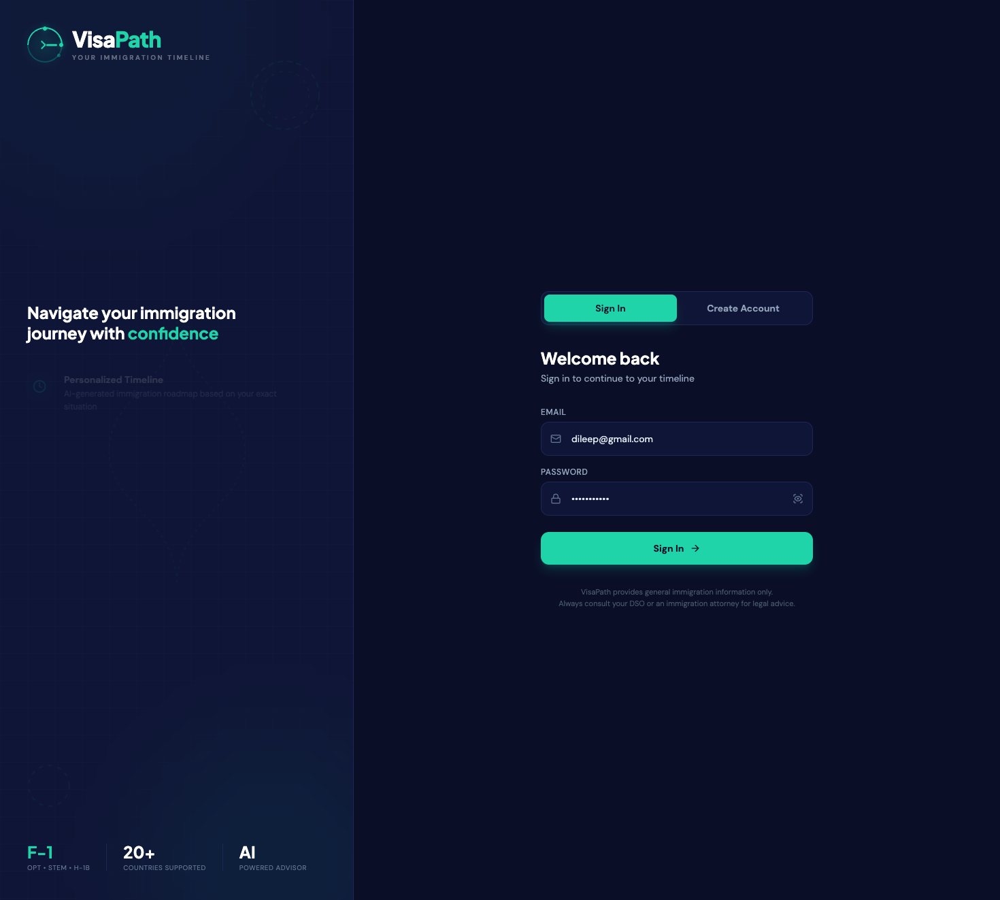 | 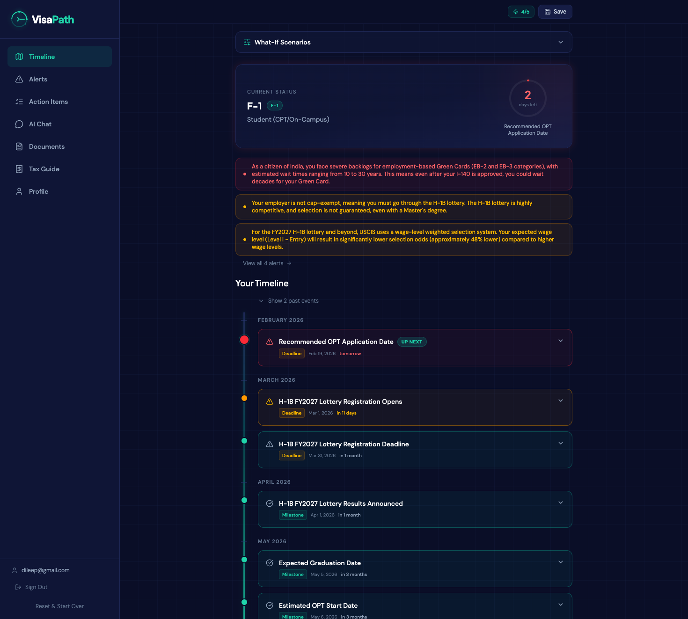 |

| Risk Alerts | Action Items |
|---|---|
| 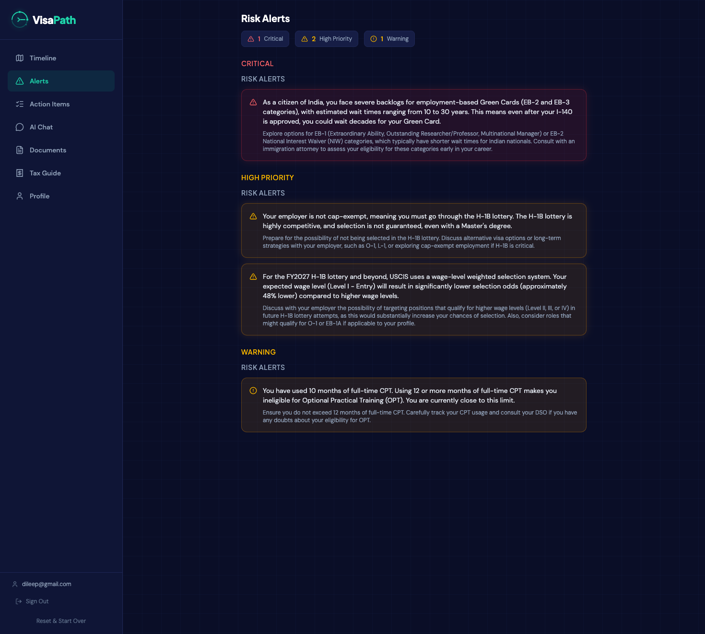 | 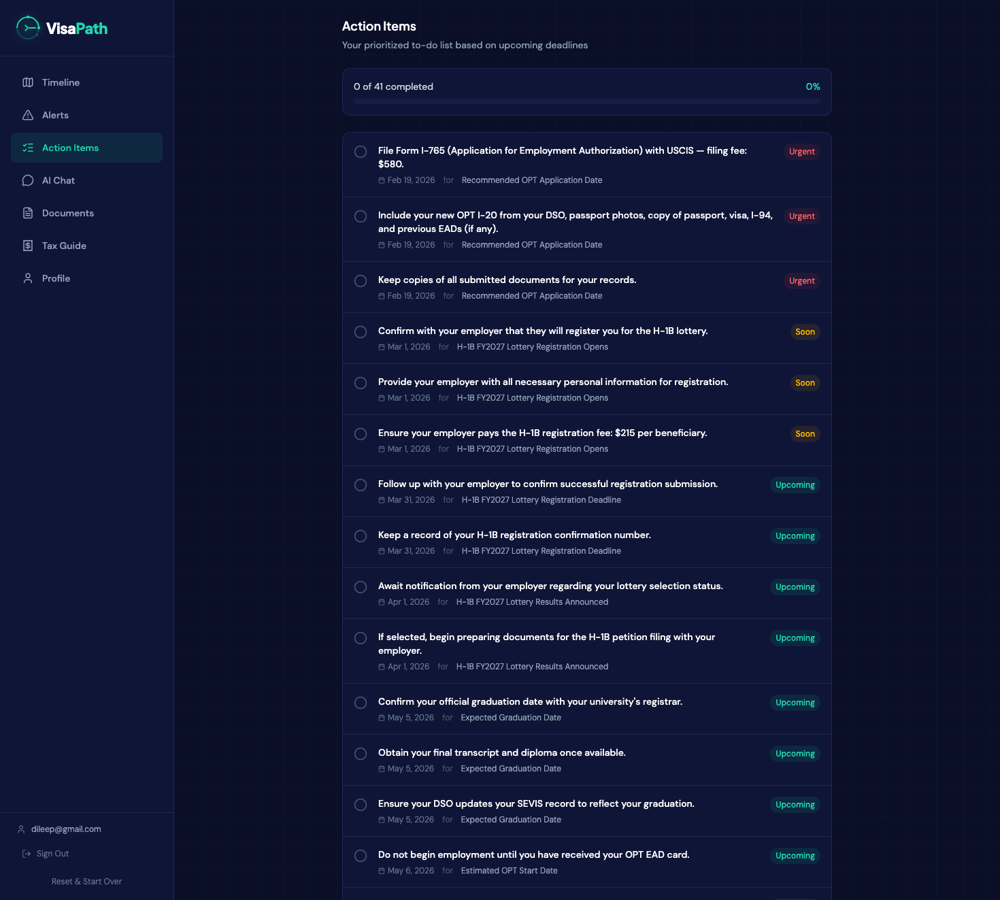 |

| AI Chat | Document Tracker |
|---|---|
| 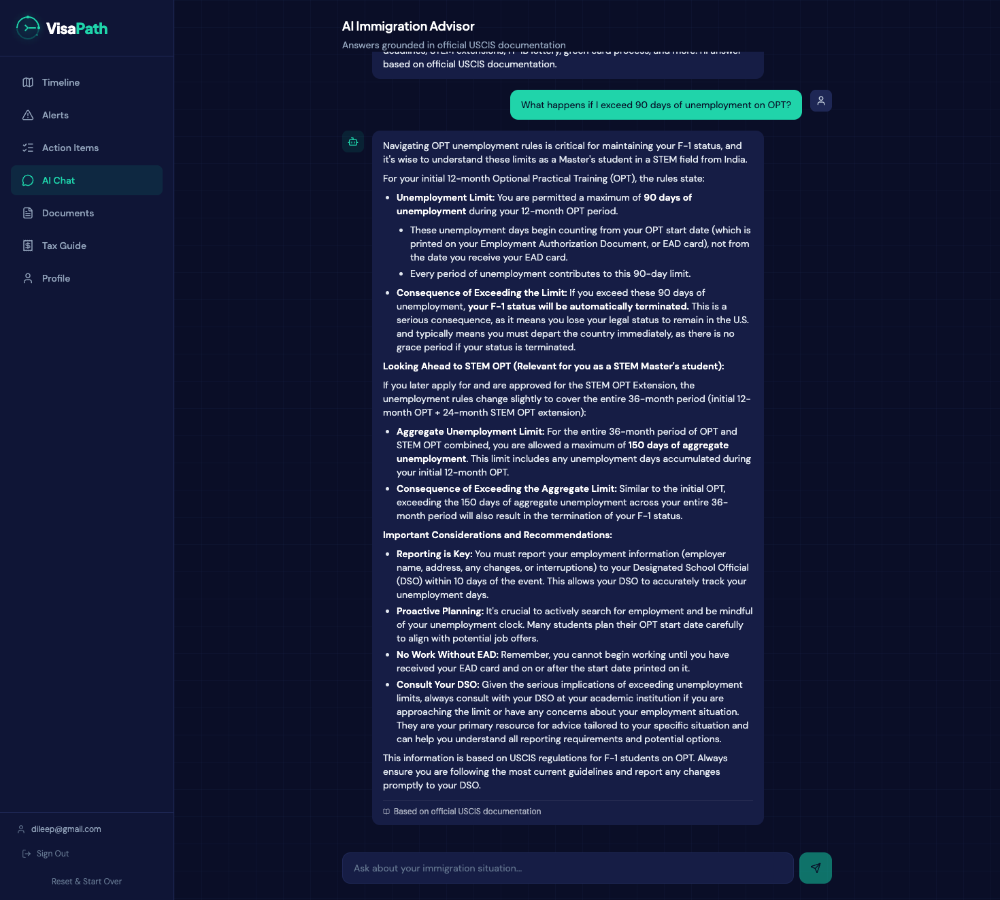 | 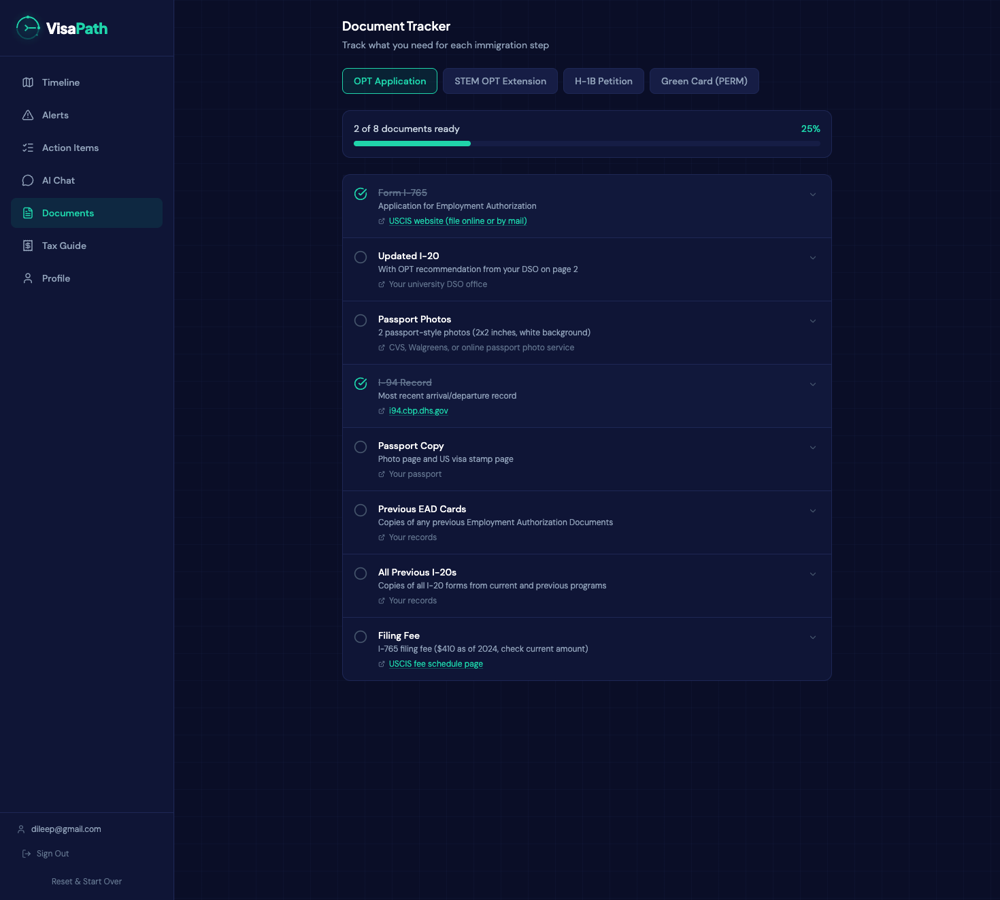 |

| Tax Guide | Profile |
|---|---|
| 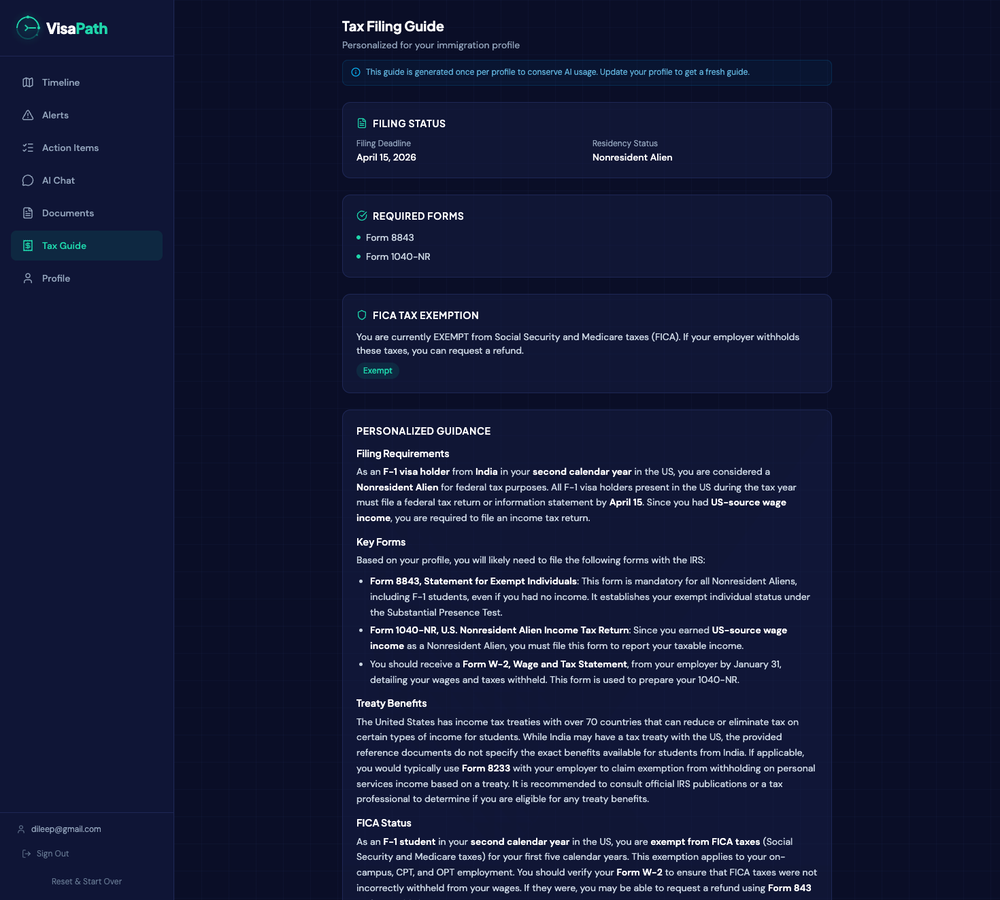 | 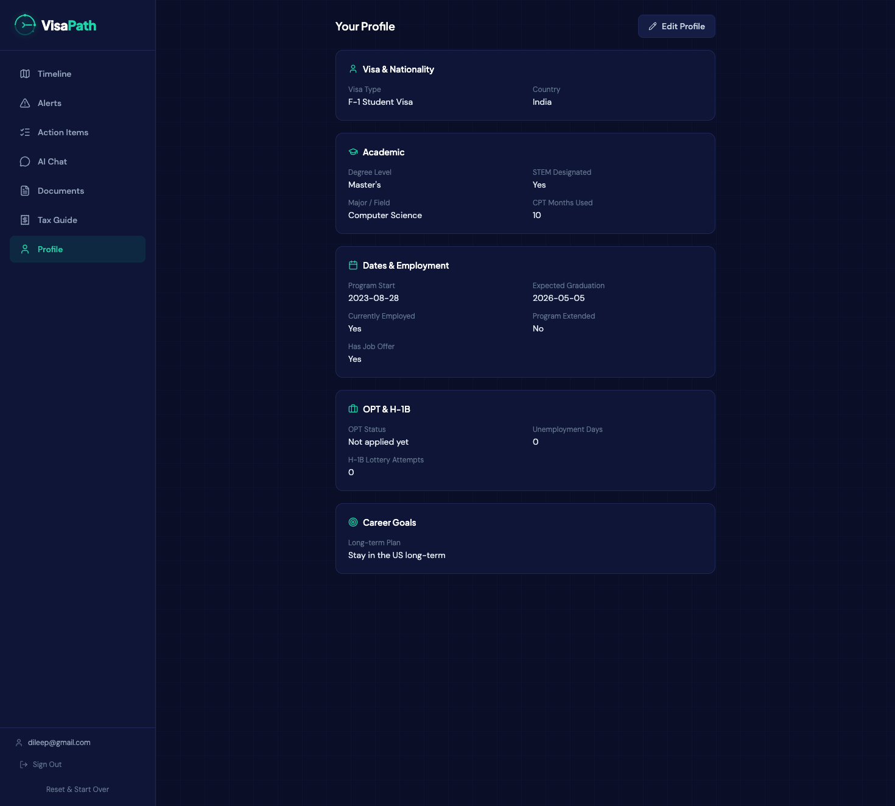 |

## Problem

There are over 1 million international students in the US right now, and every single one of them deals with a confusing mess of visa deadlines, work authorization windows, and immigration paperwork. The information they need is spread across USCIS.gov, Reddit, university DSO offices, and $300/hr immigration lawyers.

Miss one deadline and you could lose your legal status in the country.

There's no tool out there that gives a student a clear, personalized picture of their entire immigration path, from OPT application all the way to green card.

## What VisaPath Does

You fill out a short onboarding form with your visa type, program details, and career goals. VisaPath then builds you a complete immigration roadmap:

**Timeline Dashboard** - An interactive, color coded timeline showing every deadline and milestone specific to your situation. Events are grouped by month, urgency coded (critical/high/medium/low), and expandable with detailed action items.

**Risk Alerts** - The system flags things you might not think about: CPT overuse that kills your OPT eligibility, India/China green card backlogs (10-30+ year waits), H-1B lottery odds based on your wage level, approaching deadlines you haven't prepared for.

**AI Chat (RAG)** - Ask any immigration question and get answers grounded in actual USCIS documentation, not hallucinated responses. We embedded 8 immigration knowledge base documents into ChromaDB and retrieve the most relevant chunks for every query.

**Document Tracker** - Step by step checklists for OPT, STEM OPT, H-1B, and Green Card filings. Track which documents you've gathered, which ones you still need.

**Tax Guide** - AI generated tax filing guidance personalized to your visa type, country of origin, treaty benefits, and residency status.

**What-If Simulator** - Change one variable (like graduation date or STEM status) and instantly see how your entire timeline shifts.

## How It Works

1. Student fills out the onboarding form (visa type, degree, STEM status, graduation date, country, career goal)
2. The backend builds a detailed prompt with 56 hardcoded USCIS rules, current filing fees, H-1B lottery statistics, and country backlog data
3. Gemini 2.5 Flash generates a structured JSON timeline tailored to that student's exact situation
4. A separate risk analyzer flags potential issues (CPT overuse, backlog warnings, wage level lottery odds)
5. The frontend renders an interactive timeline with expandable cards, urgency colors, and month grouping
6. All results are cached so returning users see their timeline instantly

For the chat feature, 8 immigration documents are chunked and embedded into ChromaDB. When a user asks a question, we find the 4 most relevant chunks via cosine similarity and feed them alongside the user's visa context into Gemini for a grounded answer.

## Tech Stack

| Layer | Technology |
|-------|-----------|
| Frontend | React 19, TypeScript, Vite 7, Tailwind CSS v4 |
| Backend | Python 3.13, FastAPI |
| Auth | JWT + bcrypt |
| Database | SQLite (dev) / PostgreSQL (prod) |
| AI | Google Gemini 2.5 Flash |
| Embeddings | gemini-embedding-001 (768 dim) |
| Vector DB | ChromaDB |
| RAG | LangChain |
| Hosting | Azure App Service (Azure for Students) |
| CI/CD | GitHub Actions |

## Architecture

Full architecture docs with API reference: [docs/ARCHITECTURE.md](docs/ARCHITECTURE.md)

### System Overview

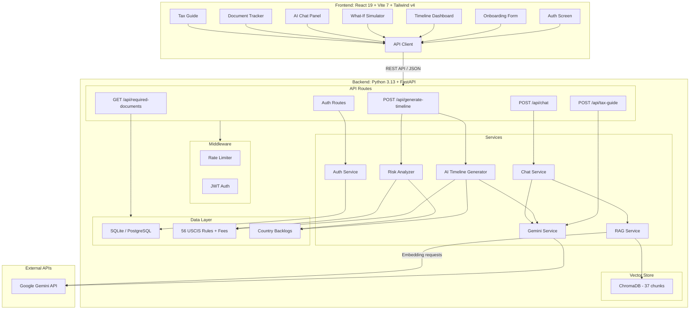
```mermaid
graph TB
    subgraph Frontend["Frontend: React 19 + Vite 7 + Tailwind v4"]
        AUTH["Auth Screen"]
        OF["Onboarding Form"]
        TD["Timeline Dashboard"]
        WIF["What-If Simulator"]
        CP["AI Chat Panel"]
        DT["Document Tracker"]
        TXG["Tax Guide"]
        API_CLIENT["API Client"]
        AUTH & OF & TD & WIF & CP & DT & TXG --> API_CLIENT
    end

    subgraph Backend["Backend: Python 3.13 + FastAPI"]
        subgraph Routes["API Routes"]
            R1["POST /api/generate-timeline"]
            R2["POST /api/chat"]
            R3["GET /api/required-documents"]
            R4["POST /api/tax-guide"]
            R_AUTH["Auth Routes"]
        end

        subgraph Middleware["Middleware"]
            RL["Rate Limiter"]
            JWT["JWT Auth"]
        end

        subgraph Services["Services"]
            TG["AI Timeline Generator"]
            RA["Risk Analyzer"]
            CS["Chat Service"]
            RAG["RAG Service"]
            GS["Gemini Service"]
            AS["Auth Service"]
        end

        subgraph Data["Data Layer"]
            DB["SQLite / PostgreSQL"]
            IR["56 USCIS Rules + Fees"]
            CB["Country Backlogs"]
        end

        subgraph VectorDB["Vector Store"]
            CHROMA["ChromaDB - 37 chunks"]
        end

        R_AUTH --> AS --> DB
        R1 --> TG & RA
        R2 --> CS
        R3 --> Data
        R4 --> GS
        TG & RA --> IR & CB
        TG --> GS
        CS --> RAG --> CHROMA
        CS --> GS
    end

    subgraph External["External APIs"]
        GEMINI["Google Gemini API"]
    end

    API_CLIENT -->|"REST API / JSON"| Routes
    Routes --> Middleware
    GS --> GEMINI
    RAG -->|"Embedding requests"| GEMINI
```

### Timeline Generation Flow

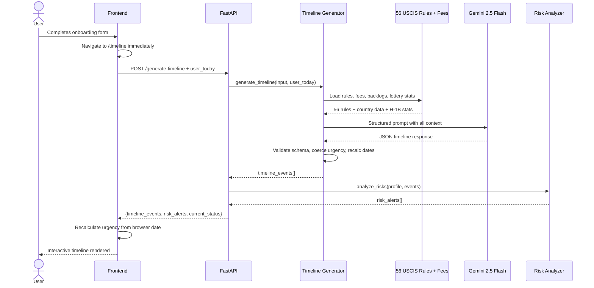
```mermaid
sequenceDiagram
    actor User
    participant FE as Frontend
    participant API as FastAPI
    participant TG as Timeline Generator
    participant Data as 56 USCIS Rules + Fees
    participant Gemini as Gemini 2.5 Flash
    participant RA as Risk Analyzer

    User->>FE: Completes onboarding form
    FE->>FE: Navigate to /timeline immediately
    FE->>API: POST /generate-timeline + user_today
    API->>TG: generate_timeline(input, user_today)
    TG->>Data: Load rules, fees, backlogs, lottery stats
    Data-->>TG: 56 rules + country data + H-1B stats
    TG->>Gemini: Structured prompt with all context
    Gemini-->>TG: JSON timeline response
    TG->>TG: Validate schema, coerce urgency, recalc dates
    TG-->>API: timeline_events[]
    API->>RA: analyze_risks(profile, events)
    RA-->>API: risk_alerts[]
    API-->>FE: {timeline_events, risk_alerts, current_status}
    FE->>FE: Recalculate urgency from browser date
    FE-->>User: Interactive timeline rendered
```

### RAG Pipeline - Grounded AI Chat

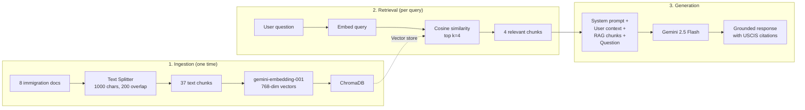
```mermaid
graph LR
    subgraph Ingestion["1. Ingestion (one time)"]
        direction TB
        DOCS["8 immigration docs"]
        SPLIT["Text Splitter<br/>1000 chars, 200 overlap"]
        CHUNKS["37 text chunks"]
        EMBED_I["gemini-embedding-001<br/>768-dim vectors"]
        STORE["ChromaDB"]
        DOCS --> SPLIT --> CHUNKS --> EMBED_I --> STORE
    end

    subgraph Retrieval["2. Retrieval (per query)"]
        direction TB
        QUERY["User question"]
        EMBED_Q["Embed query"]
        SEARCH["Cosine similarity<br/>top k=4"]
        RESULTS["4 relevant chunks"]
        QUERY --> EMBED_Q --> SEARCH --> RESULTS
    end

    subgraph Generation["3. Generation"]
        direction TB
        PROMPT["System prompt +<br/>User context +<br/>RAG chunks +<br/>Question"]
        LLM["Gemini 2.5 Flash"]
        RESPONSE["Grounded response<br/>with USCIS citations"]
        PROMPT --> LLM --> RESPONSE
    end

    STORE -.->|"Vector store"| SEARCH
    RESULTS --> PROMPT
```

### User Flow

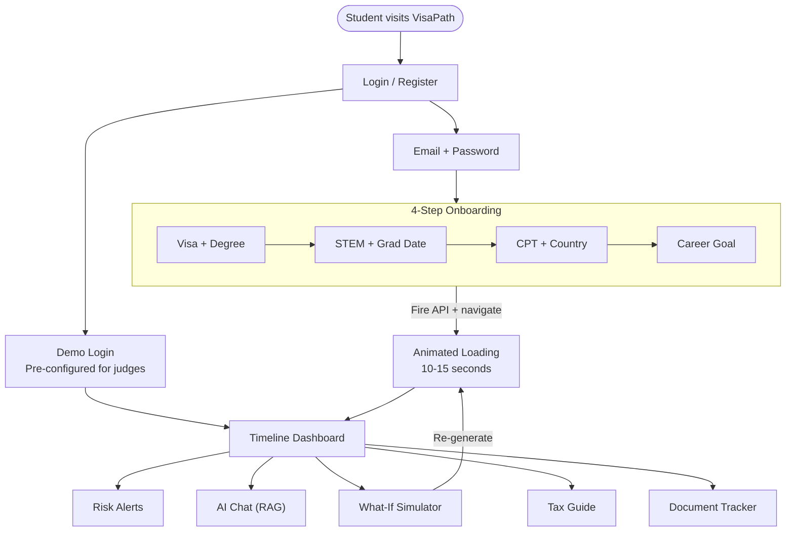
```mermaid
flowchart TB
    START(["Student visits VisaPath"])
    START --> LOGIN["Login / Register"]
    LOGIN --> DEMO["Demo Login<br/>Pre-configured for judges"]
    LOGIN --> REG["Email + Password"]

    DEMO --> TIMELINE
    REG --> ONBOARD

    subgraph ONBOARD["4-Step Onboarding"]
        direction LR
        S1["Visa + Degree"] --> S2["STEM + Grad Date"] --> S3["CPT + Country"] --> S4["Career Goal"]
    end

    ONBOARD -->|"Fire API + navigate"| LOADING["Animated Loading<br/>10-15 seconds"]
    LOADING --> TIMELINE

    TIMELINE["Timeline Dashboard"] --> RISKS["Risk Alerts"]
    TIMELINE --> CHAT["AI Chat (RAG)"]
    TIMELINE --> WHATIF["What-If Simulator"]
    TIMELINE --> TAX["Tax Guide"]
    TIMELINE --> DOCS["Document Tracker"]

    WHATIF -->|"Re-generate"| LOADING
```

## Setup & Installation

### Prerequisites

- Python 3.11+
- Node.js 18+
- A Google Gemini API key (free at [aistudio.google.com/apikey](https://aistudio.google.com/apikey))

### Clone and configure

```bash
git clone https://github.com/dileep-kumar-sharma/visapath.git
cd visapath
cp .env.example .env
```

Edit `.env`:
```
GEMINI_API_KEY=your_gemini_api_key_here
JWT_SECRET=your_jwt_secret_here
DATABASE_URL=sqlite:///./visapath.db
```

### Backend

```bash
cd backend
python3 -m venv venv
source venv/bin/activate   # Windows: venv\Scripts\activate
pip install -r requirements.txt
python app/rag/ingest.py   # one time: embed docs into ChromaDB
uvicorn app.main:app --host 0.0.0.0 --port 8000
```

API available at `http://localhost:8000` (Swagger docs at `/docs`).

### Frontend

```bash
cd frontend
npm install
npm run dev
```

Opens at `http://localhost:5173`. Vite proxies `/api` to the backend automatically.

### Production build

```bash
cd frontend
npm run build   # outputs to frontend/dist/
```

## Project Structure

```
visapath/
├── backend/
│   ├── requirements.txt
│   └── app/
│       ├── main.py                      # FastAPI entry, CORS, routers
│       ├── database.py                  # SQLite/PostgreSQL, schema, CRUD
│       ├── dependencies.py              # JWT validation middleware
│       ├── ai_rate_limit.py             # Daily AI request tracker
│       ├── rate_limit.py                # Per-IP rate limiting
│       ├── routes/
│       │   ├── auth.py                  # Register, login, profile, caching
│       │   ├── timeline.py              # POST /api/generate-timeline
│       │   ├── chat.py                  # POST /api/chat
│       │   ├── tax_guide.py             # POST /api/tax-guide
│       │   └── documents.py             # GET /api/required-documents
│       ├── services/
│       │   ├── ai_timeline_generator.py # Gemini prompt + JSON parsing
│       │   ├── timeline_generator.py    # Rule based timeline calc
│       │   ├── risk_analyzer.py         # Risk detection + severity
│       │   ├── gemini_service.py        # Gemini API wrapper
│       │   ├── rag_service.py           # RAG embed/search/retrieve
│       │   └── auth_service.py          # Registration, login, JWT
│       ├── data/
│       │   ├── immigration_rules.py     # 56 USCIS rules + filing fees
│       │   ├── stem_cip_codes.py        # 60+ STEM CIP codes
│       │   └── country_backlogs.py      # Green card waits + H-1B stats
│       └── rag/
│           ├── ingest.py                # Embed docs into ChromaDB
│           ├── documents/               # 8 knowledge base text files
│           └── chroma_db/               # Vector store (generated)
│
├── frontend/
│   ├── package.json
│   ├── vite.config.ts
│   └── src/
│       ├── App.tsx                      # Route tree with auth guards
│       ├── index.css                    # Tailwind + custom dark theme
│       ├── contexts/AuthContext.tsx      # Global auth + data state
│       ├── utils/api.ts                 # API client
│       ├── types/index.ts               # TypeScript interfaces
│       ├── pages/                       # Route wrappers
│       └── components/                  # All UI components
│
├── docs/
│   ├── ARCHITECTURE.md                  # Full architecture + API docs
│   ├── PROJECT_BRIEF.md                 # One page project brief
│   └── SUBMISSION_CHECKLIST.md          # Submission requirements tracker
│
├── .env.example
└── .gitignore
```

## Deployment

Hosted on Azure using Azure for Students credits:

| Component | Service | Tier |
|-----------|---------|------|
| Backend + Frontend | Azure App Service | Free (F1) |
| Database | PostgreSQL on Azure | Basic |
| AI | Google Gemini API | Free tier |
| Vector DB | ChromaDB (embedded) | Runs inside backend |
| CI/CD | GitHub Actions | Auto deploy on push to main |

## Team

| Name | Role |
|------|------|
| Dileep Kumar Sharma | Full stack dev: backend, AI integration, frontend, deployment |

## AI Disclosure

**Runtime AI (in the product):**
- Google Gemini 2.5 Flash powers timeline generation, the chat Q&A, and tax guide generation
- Google gemini-embedding-001 creates the vector embeddings used for RAG retrieval

**Development AI (building the product):**
- Claude Code (Anthropic) was used as a coding assistant during the hackathon for code generation, debugging, and iteration

All immigration guidance in the app includes disclaimers that it's general information, not legal advice. Users are always told to consult their DSO or an immigration attorney for their specific situation.

## Future Roadmap

1. Push notifications for upcoming deadlines (email + browser)
2. Support for more visa types: J-1, L-1, O-1
3. Cap-exempt employer lookup and E-Verify verification database
4. Anonymous community Q&A forum for international students
5. React Native mobile app for on the go deadline tracking
6. Live USCIS processing time data integration
7. University DSO dashboard for advising students at scale

## License

Built for DevDash 2026. All rights reserved.
