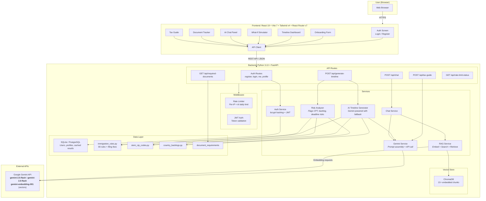
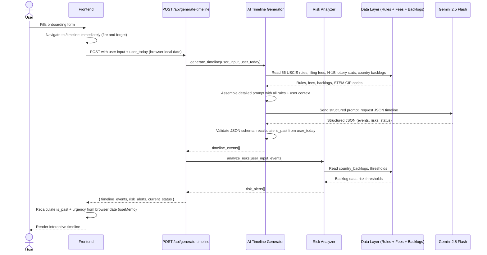
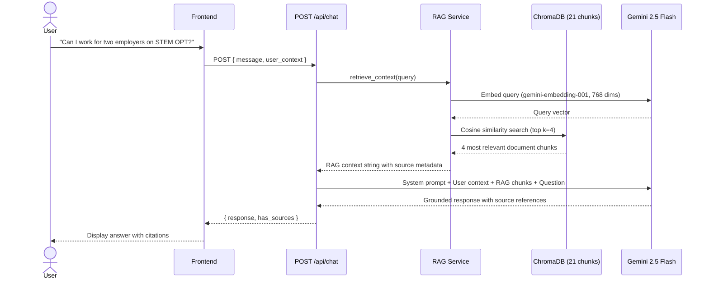
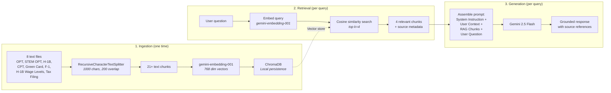

# VisaPath: Architecture & Technical Documentation

## Table of Contents

- [System Architecture](#system-architecture)
- [Request Flows](#request-flows)
- [API Endpoints](#api-endpoints)
- [Timeline Generation Engine](#timeline-generation-engine)
- [Risk Analysis Engine](#risk-analysis-engine)
- [RAG Pipeline](#rag-pipeline)
- [AI Chat Service](#ai-chat-service)
- [Data Layer](#data-layer)
- [Authentication](#authentication)
- [Rate Limiting](#rate-limiting)
- [Frontend Architecture](#frontend-architecture)

## System Architecture



## Request Flows

### Timeline Generation



### AI Chat (RAG Pipeline)



## API Endpoints

### `POST /api/generate-timeline`

Generates a personalized immigration timeline using AI.

**Request Body:**
```json
{
  "visa_type": "F-1",
  "degree_level": "Master's",
  "is_stem": true,
  "program_start": "2024-08-20",
  "expected_graduation": "2026-05-15",
  "cpt_months_used": 6,
  "currently_employed": true,
  "has_job_offer": true,
  "employer_is_cap_exempt": false,
  "wage_level": 2,
  "opt_status": "not_yet",
  "opt_ead_end_date": "",
  "career_goal": "stay_us_longterm",
  "country": "India",
  "user_today": "2026-02-17"
}
```

**Response:**
```json
{
  "timeline_events": [
    {
      "id": "opt_apply_window_open",
      "title": "OPT Application Window Opens",
      "date": "2026-02-14",
      "type": "deadline",
      "urgency": "critical",
      "description": "You can start applying for post-completion OPT...",
      "action_items": ["Request OPT recommendation from DSO", "..."],
      "is_past": false
    }
  ],
  "risk_alerts": [
    {
      "type": "country_backlog",
      "severity": "warning",
      "message": "As a national of India, EB-2/EB-3 green card wait times...",
      "recommendation": "Consider EB-1 eligibility..."
    }
  ],
  "current_status": {
    "visa": "F-1",
    "work_auth": "Student (CPT/On-Campus)",
    "days_until_next_deadline": 1,
    "next_deadline": "OPT Application Window Opens"
  }
}
```

### `POST /api/chat`

AI Q&A with RAG context retrieval.

**Request Body:**
```json
{
  "message": "Can I work for two employers on STEM OPT?",
  "user_context": {
    "visa_type": "F-1",
    "degree_level": "Master's",
    "is_stem": true,
    "country": "India"
  }
}
```

**Response:**
```json
{
  "response": "Yes, you can work for multiple employers on STEM OPT, but each employer must be enrolled in E-Verify...",
  "has_sources": true
}
```

### `POST /api/tax-guide`

AI generated personalized tax filing guide.

**Request Body:**
```json
{
  "visa_type": "F-1",
  "country": "India",
  "has_income": true,
  "income_types": ["wages"],
  "years_in_us": 2
}
```

**Response:**
```json
{
  "filing_deadline": "April 15, 2026",
  "residency_status": "Nonresident Alien",
  "required_forms": ["Form 8843", "Form 1040-NR"],
  "treaty_benefits": { "country": "India", "benefit": "...", "form": "Form 8233" },
  "fica_exempt": true,
  "guidance": "### Filing Requirements\n...",
  "disclaimer": "This is general guidance, not legal or tax advice."
}
```

### `GET /api/required-documents?step=opt_application`

Returns document checklists for immigration steps.

Available steps: `opt_application`, `stem_opt_extension`, `h1b_petition`, `green_card_perm`

### `GET /api/rate-limit-status`

Returns current AI usage so the frontend can pre-check before triggering expensive AI calls.

**Response:**
```json
{
  "used": 5,
  "limit": 1500,
  "remaining": 1495,
  "allowed": true,
  "retry_after": 0
}
```

### Auth Endpoints

| Endpoint | Method | Description |
|----------|--------|-------------|
| `/api/auth/register` | POST | Create account (email + password) |
| `/api/auth/login` | POST | Login, returns JWT token |
| `/api/auth/me` | GET | Get current user profile + cached data |
| `/api/auth/profile` | PUT | Save/update user profile |
| `/api/auth/cached-timeline` | PUT | Cache AI generated timeline |
| `/api/auth/cached-tax-guide` | PUT | Cache AI generated tax guide |
| `/api/auth/save-timeline` | POST | Save timeline to history |
| `/api/auth/my-timelines` | GET | Get saved timeline history |

## Timeline Generation Engine

**File:** `backend/app/services/ai_timeline_generator.py`

The AI timeline generator assembles a comprehensive prompt with all immigration context and sends it to Gemini 2.5 Flash for structured JSON output.

### Prompt Assembly

The prompt includes:
1. **User profile**: visa type, degree, STEM status, graduation date, employment, career goal, country
2. **56 hardcoded USCIS rules**: OPT windows, STEM OPT extensions, H-1B lottery, cap-gap, unemployment limits
3. **USCIS filing fees**: $580 I-765 (OPT), $780 I-129 (H-1B), $215 H-1B registration, $2,805 premium processing
4. **H-1B lottery statistics**: FY2024 through FY2027 registration counts, selection rates, wage level weighted selection
5. **Country backlog data**: EB-1/EB-2/EB-3 wait times by country
6. **Today's date**: from user's browser (timezone correct)

### Supported Visa Pathways

- F-1 > OPT > STEM OPT > H-1B > Green Card
- F-1 > H-1B (direct, cap exempt employers)
- OPT > STEM OPT > H-1B
- H-1B > Green Card (PERM > I-140 > I-485)

### Urgency Calculation

The frontend recalculates urgency on every render so cached timelines never show stale data:

| Urgency | Condition | Color |
|---------|-----------|-------|
| `critical` | 7 days away or less | Red |
| `high` | 30 days away or less | Amber |
| `medium` | 90 days away or less | Teal |
| `low` | More than 90 days away | Slate |
| `passed` | Date is in the past | Dim |

## Risk Analysis Engine

**File:** `backend/app/services/risk_analyzer.py`

Evaluates user input and flags potential immigration issues.

| Risk | Severity | Trigger |
|------|----------|---------|
| CPT overuse (12+ months) | Critical | Kills OPT eligibility |
| CPT approaching limit (9+ months) | Warning | Close to losing OPT |
| Country backlog (India/China) | Warning | 10-30+ year green card waits |
| OPT deadline approaching (<30 days) | Critical | Risk of missing OPT window |
| Non-STEM limited OPT | Info | Only 12 months, no extension |
| Unemployment on OPT | High | 90/150 day limits |
| H-1B lottery uncertainty | Info | ~25-30% selection rate |
| Low wage level + H-1B FY2027+ | Warning | Lower selection odds under weighted lottery |

## RAG Pipeline

**Files:**
- `backend/app/services/rag_service.py` for RAG orchestration
- `backend/app/rag/ingest.py` for document ingestion
- `backend/app/rag/documents/` for the source knowledge base (8 documents)

### How It Works



### Knowledge Base Documents

| File | Content |
|------|---------|
| `opt_rules.txt` | OPT eligibility, application process, deadlines, unemployment limits |
| `stem_opt_extension.txt` | STEM OPT extension rules, E-Verify, I-983, employment rules |
| `h1b_visa.txt` | H-1B cap, lottery, petition process, cap-gap, portability |
| `h1b_wage_level_selection.txt` | FY2027+ wage level weighted H-1B selection system |
| `cpt_rules.txt` | CPT eligibility, types, 12-month rule, application process |
| `green_card_process.txt` | EB categories, PERM, I-140, I-485, country backlogs, AC21 |
| `f1_general_rules.txt` | F-1 status maintenance, employment options, SEVIS, violations |
| `international_student_tax_filing.txt` | Tax residency, forms, treaty benefits, FICA exemption |

### Technical Details

- **Splitter:** RecursiveCharacterTextSplitter (LangChain), 1000 chars, 200 overlap
- **Embedding Model:** models/gemini-embedding-001 (768 dimensions)
- **Vector Store:** ChromaDB (embedded, serverless, local persistence)
- **Search:** Cosine similarity, top k=4 results per query

## AI Chat Service

**File:** `backend/app/services/gemini_service.py`

**Model:** gemini-2.5-flash (primary) with gemini-2.0-flash as fallback

**Prompt Structure:**
```
[System Instruction]
You are VisaPath AI, an expert immigration advisor...
- Answer questions about US immigration processes
- Provide accurate, actionable advice based on USCIS rules
- Always cite specific rules, deadlines, or requirements
- Never provide legal advice, frame as general information

[User Context]
Visa: F-1, Degree: Master's, STEM: Yes, Country: India

[Reference Documents]
<RAG retrieved chunks with source metadata>

[User Question]
Can I work for two employers on STEM OPT?
```

## Data Layer

### Immigration Rules (`immigration_rules.py`)

Hardcoded USCIS rules as Python dictionaries:

```python
OPT_RULES = {
    "apply_before_graduation_days": 90,
    "apply_after_graduation_days": 60,
    "duration_months": 12,
    "unemployment_limit_days": 90,
}

STEM_OPT_RULES = {
    "extension_months": 24,
    "unemployment_limit_days": 150,
    "requires_e_verify": True,
}

H1B_RULES = {
    "regular_cap": 65000,
    "masters_cap": 20000,
    "registration_month": 3,  # March
    "start_date_month": 10,   # October 1
    "cap_exempt_employers": ["universities", "nonprofit_research", "government_research"],
}

FILING_FEES = {
    "I-765_OPT": 580,
    "I-129_H1B": 780,
    "H1B_registration": 215,
    "premium_processing": 2805,
    ...
}
```

### Country Backlogs (`country_backlogs.py`)

| Country | EB-1 | EB-2 | EB-3 |
|---------|------|------|------|
| India | 2-4 years | 10-30+ years | 10-25+ years |
| China | 1-3 years | 4-8 years | 4-8 years |
| Rest of World | 0-1 years | 0-2 years | 0-2 years |

### STEM CIP Codes (`stem_cip_codes.py`)

60+ common STEM Designated Degree Program CIP codes including Computer Science (11.0701), Engineering (14.xxxx), Mathematics (27.xxxx), Data Science (30.3101), etc.

## Authentication

- **Registration:** Email + password, bcrypt hashing (salt rounds: 12)
- **Login:** Returns JWT token (24h expiry)
- **Token validation:** `dependencies.py` extracts user from JWT on protected routes
- **Route guards (frontend):** `RequireAuth` redirects to /login, `RequireOnboarded` redirects to /onboarding, `RequireAdmin` restricts /admin

## Rate Limiting

Four layers:

1. **Per-IP rate limiting** (`rate_limit.py`) protects auth endpoints from brute force
2. **Daily AI request tracker** (`ai_rate_limit.py`) limits total Gemini API calls per day
3. **Frontend pre-check** via `GET /api/rate-limit-status` lets the frontend fast fail before expensive AI calls
4. **Gemini 429 sticky marker** triggers a 5-minute cooldown after receiving a Gemini rate limit error

## Frontend Architecture

### State Management

`AuthContext.tsx` manages all global state:
- User authentication (login, register, logout)
- User profile and onboarding data
- Cached timeline and tax guide
- AI generation loading states (the `generating` flag drives the loading skeleton)

### Routing

```
/login          > LoginPage (public)
/onboarding     > OnboardingPage (auth required)
/timeline       > TimelinePage (auth + onboarded)
/alerts         > AlertsPage (auth + onboarded)
/actions        > ActionsPage (auth + onboarded)
/chat           > ChatPage (auth + onboarded)
/documents      > DocumentsPage (auth + onboarded)
/tax-guide      > TaxGuidePage (auth + onboarded)
/profile        > ProfilePage (auth + onboarded)
/admin          > AdminPage (admin only)
*               > Redirect to /timeline
```

### Key Design Decisions

- **Fire and forget navigation:** Onboarding submits data and immediately navigates to `/timeline`, showing the loading skeleton while AI generates in the background
- **Client side date recalculation:** `TimelineDashboard` recalculates `is_past` and `urgency` from the browser date via `useMemo` on every render, so cached timelines never go stale
- **Browser local date:** Frontend sends `user_today` with timeline requests for timezone correct date handling
